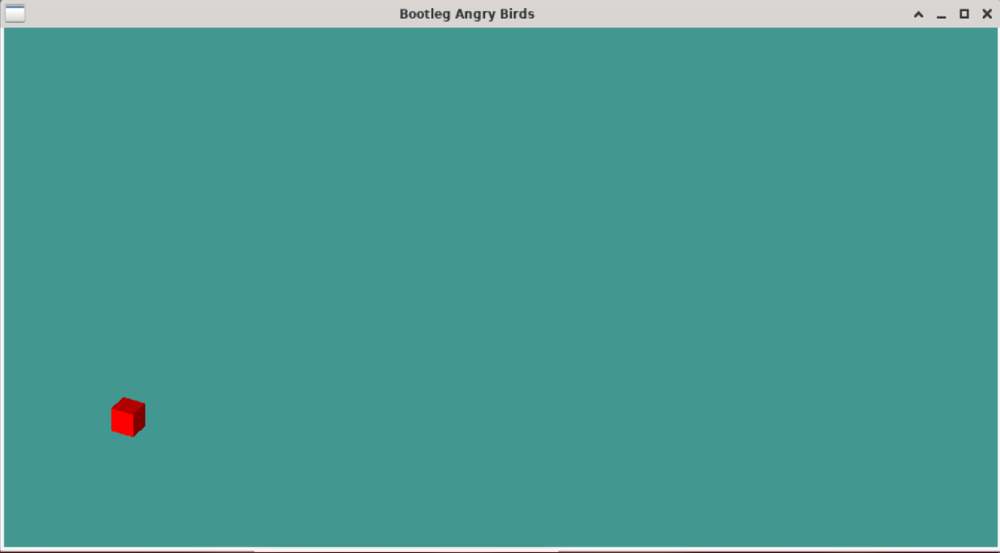
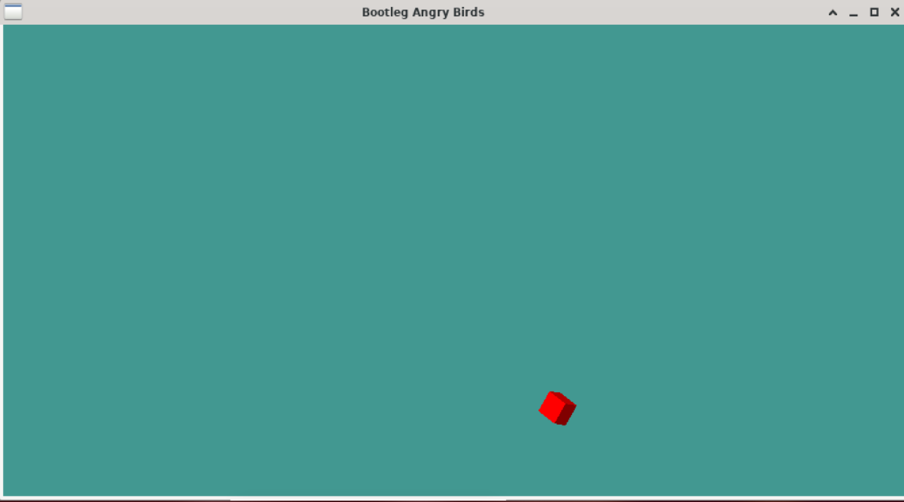

# Block Slinger Game

## Purpose
Game where the player uses the mouse to sling a block as it ricochets off the wall. The code simulates physics by using things like the position of the mouse where it releases versus where it first clicked and the position of the block to determine things like the speed and direction of the block.

## How to use
This program requires OpenGL to compile properly. In your command line, type `g++ block_game.cpp -o block_game.exe -lGL -lGLU -lglut` to compile and get "block_game.exe". Next, type `./block_game.exe` to execute the program.

## How to play
Click and hold the left mouse to pull the block around. Release left mouse to let the block go. The direction of the pull and distance from the block's origin will determine the direction and speed of the block as it flies across the screen.

